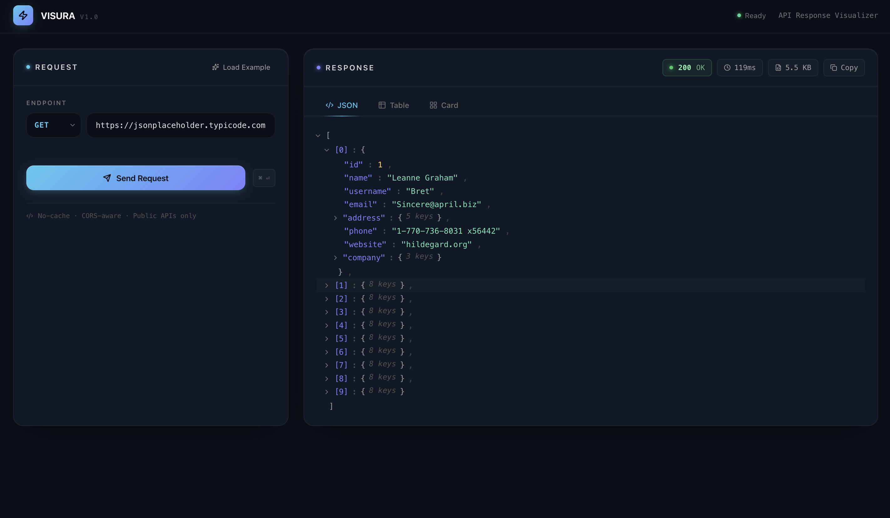
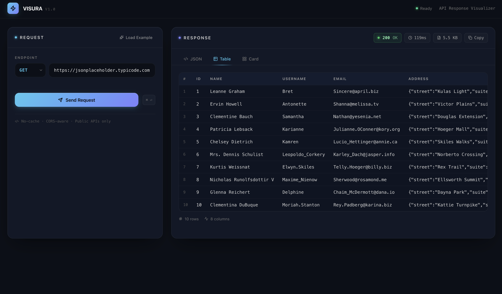
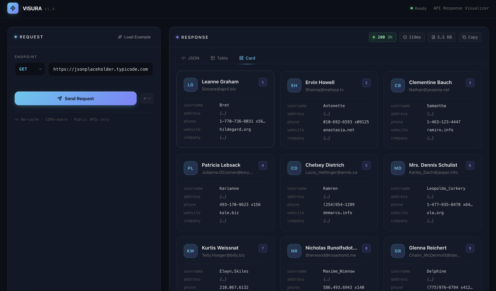

<p align="center">
  
</p>

<h1 align="center">VISURA</h1>

<p align="center">
  <strong>A polished API response visualizer for developers who care about clarity.</strong>
</p>

<p align="center">
  <a href="https://bwhite261.github.io/visura">Live Demo</a> · 
  <a href="#features">Features</a> · 
  <a href="#getting-started">Getting Started</a> · 
  <a href="#usage">Usage</a>
</p>

<p align="center">
  
  
  
  
</p>

---

<p align="center">
  
</p>

---

## What is VISURA?

VISURA is a browser-based developer tool for exploring and visualizing API responses. Instead of staring at walls of raw JSON, VISURA transforms your API data into three distinct visual formats — an interactive tree, a sortable table, and a structured card grid — so you can understand what an API returns at a glance.

No backend. No authentication. No installation required. Just open it, point it at an API, and see your data come to life.

---

## Features

### Three Visualization Modes

**JSON Tree View** — An interactive, collapsible tree that mirrors the full structure of any JSON response. Expand or collapse nested objects and arrays at any depth. Color-coded by type: strings in green, numbers in amber, booleans in cyan, nulls in gray.

<p align="center">
  
</p>

**Table View** — When your response is an array of objects, VISURA automatically detects all columns and renders a clean, scrollable data table. Missing fields are handled gracefully. Row count and column count are shown at a glance.

<p align="center">
  
</p>

**Card View** — Each object in your response becomes a structured card. VISURA intelligently surfaces key fields like `name`, `title`, `id`, and `email` as headlines and subtext, with remaining fields displayed as a compact property list.

<p align="center">
  
</p>

### Request Builder
- Support for `GET` and `POST` methods
- JSON body editor with live validation for `POST` requests
- Keyboard shortcut `⌘ + Enter` to send requests
- Load Example button to prefill common public API endpoints

### Response Metadata
- HTTP status code with color-coded indicator (green / yellow / red)
- Response time in milliseconds
- Response size in bytes / KB
- One-click copy-to-clipboard for the full response

### UX Details
- Skeleton loading state while fetching
- Human-readable error messages with troubleshooting hints
- Smooth tab transitions and card entrance animations
- Auto-selects the best view based on response shape

---

## Getting Started

### Prerequisites

- Node.js 18+
- npm 9+

### Installation

```bash
# Clone the repository
git clone https://github.com/bwhite261/visura.git
cd visura

# Install dependencies
npm install

# Start the development server
npm run dev
```

Open [http://localhost:5173/visura](http://localhost:5173/visura) in your browser.

### Build for Production

```bash
npm run build
```

### Deploy to GitHub Pages

```bash
npm run deploy
```

The app will be live at `https://bwhite261.github.io/visura`.

---

## Usage

1. **Enter a URL** in the endpoint field on the left panel
2. **Select a method** — `GET` or `POST`
3. **Add a request body** (POST only) — the editor validates JSON in real time
4. **Click Send** or press `⌘ + Enter`
5. **Explore the response** using the JSON, Table, or Card tabs on the right

### Try It With These Public APIs

| API | URL |
|-----|-----|
| JSONPlaceholder Users | `https://jsonplaceholder.typicode.com/users` |
| JSONPlaceholder Posts | `https://jsonplaceholder.typicode.com/posts?_limit=8` |
| GitHub Repos | `https://api.github.com/users/anthropics/repos` |

> **Note:** VISURA runs entirely in your browser and fetches APIs directly. Endpoints must support public CORS access.

---

## Tech Stack

| Tool | Purpose |
|------|---------|
| [React 18](https://react.dev) | UI framework |
| [Vite](https://vitejs.dev) | Build tool and dev server |
| [Tailwind CSS v3](https://tailwindcss.com) | Utility-first styling |
| [Lucide React](https://lucide.dev) | Icon library |
| [gh-pages](https://github.com/tschaub/gh-pages) | GitHub Pages deployment |

---

## Project Structure

```
visura/
├── public/
├── src/
│   ├── App.jsx          # Full application (single-file architecture)
│   ├── main.jsx         # React entry point
│   └── index.css        # Tailwind base styles
├── index.html
├── vite.config.js
├── tailwind.config.js
└── package.json
```

---

## Design System

VISURA uses a custom dark SaaS design language:

| Token | Value |
|-------|-------|
| Background | `#0B0F17` |
| Panel | `#111827` |
| Card | `#121A2A` |
| Primary (Cyan) | `#4CC9F0` |
| Secondary (Indigo) | `#7C83FD` |
| Success | `#22C55E` |
| Warning | `#FBBF24` |
| Error | `#EF4444` |

---

## Roadmap

- [ ] Response history / request log
- [ ] Custom request headers editor
- [ ] Dark/light theme toggle
- [ ] Export response as JSON, CSV, or Markdown table
- [ ] Shareable request URLs via query params
- [ ] Environment variable support

---

## Contributing

Contributions are welcome. Please open an issue first to discuss what you'd like to change, then submit a pull request.

```bash
# Fork the repo, then:
git checkout -b feature/your-feature-name
git commit -m "Add your feature"
git push origin feature/your-feature-name
# Open a pull request on GitHub
```

---

## License

MIT © [bwhite261](https://github.com/bwhite261)

---

<p align="center">
  Built with care for developers who deserve better tools.
</p>
